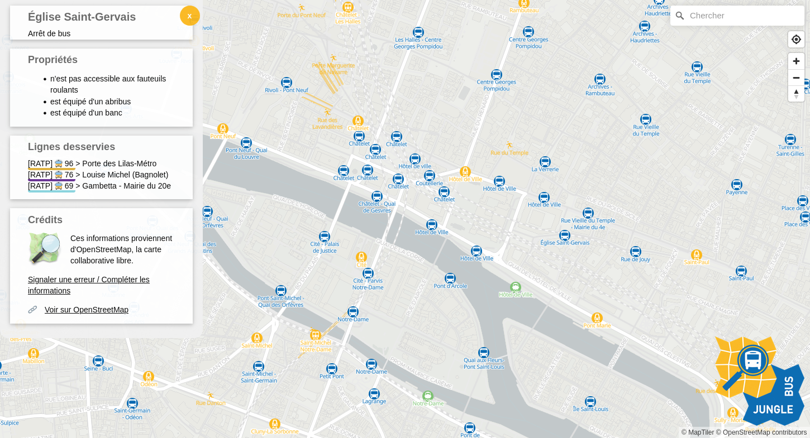
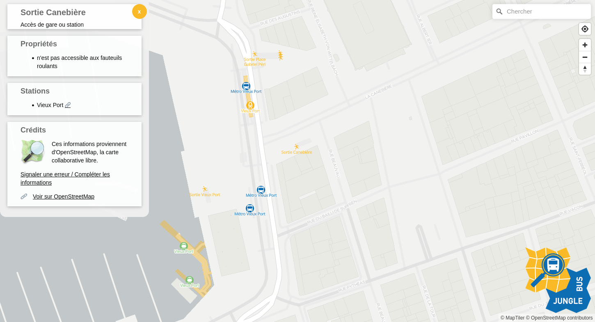

# Bienvenue !

Cet outil vous permet d'explorer les données de mobilité déjà existantes dans OpenStreetMap.

OpenStreetMap, le wikipédia de la cartographie, est aujourd'hui considéré comme la base de données cartographique ouverte la plus exhaustive au monde. OpenStreetMap permet notamment la description détaillée des données de mobilité et réseaux de transport.

Cliquez sur un arrêt ou une gare pour découvrir les informations qu'OpenStreetMap a sur cet objet.

## Crédits

Ce projet a été développé par l'équipe de l'entreprise [Jungle Bus](http://junglebus.io/).

Le code source est placé sous licence GPL-3.0.

